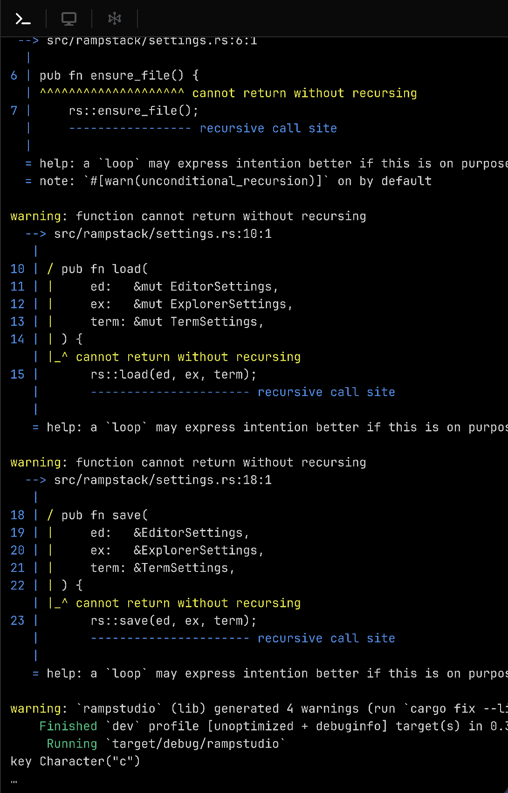

# Terminal

<p align="center">
  
</p>

<p align="center">
  A reusable terminal component for Quartz projects. Scrollable output buffer, ANSI colour support, live input row, command history, and shell execution — all in a single mountable component.
</p>

---

## What it is

Terminal is a self-contained Quartz component that renders a scrollable output buffer with a live input row and a blinking cursor. It spawns shell commands in background threads, streams stdout and stderr into the buffer as they arrive, and handles built-in commands (`cd`, `pwd`, `clear`) inline.

It is designed to be dropped into any canvas panel and resized at runtime. All state is internal — no canvas variables are required from the caller.

---

## Usage

```rust
use terminal::{mount, run_command, Line};
use quartz::file_watcher::Shared;

let font_bytes = assets.get_font("JetBrainsMono-Regular.ttf").expect("font");
let cwd        = Shared::new(std::env::current_dir()?.to_string_lossy().to_string());

// on_command is called whenever the user presses Enter
let cwd_cb = cwd.clone();
let term = terminal::mount(
    ctx,
    scene,
    layer_id,
    font_bytes,
    None,  // use default TermSettings
    move |cmd, t| {
        run_command(cmd, t, &cwd_cb);
    },
);
```

`mount` returns a `Terminal` handle you keep for the lifetime of the application.

---

## Positioning and resizing

Set `offset_x` and `offset_y` on `TermSettings` to position the panel. Update them each tick from your layout loop and the terminal will reflow on the next frame:

```rust
{
    let mut s = term.settings.get_mut();
    s.offset_x = panels.terminal.0;
    s.offset_y = panels.terminal.1;
}
```

The background fill and all text slots resize automatically to match the available space.

---

## Settings

`TermSettings` controls appearance and layout. Pass a `Shared<TermSettings>` to `mount` if you want to adjust settings after startup, or pass `None` to use the defaults.

```rust
use terminal::TermSettings;
use quartz::file_watcher::Shared;

let settings = Shared::new(TermSettings {
    font_size:   13.0,
    line_height: 1.55,
    pad_x:       12.0,
    pad_y:       10.0,
    ..Default::default()
});

let term = terminal::mount(ctx, scene, layer_id, font_bytes, Some(settings.clone()), on_cmd);

// Change at runtime — takes effect on the next tick
settings.get_mut().font_size = 15.0;
```

---

## Pushing output

You can write into the terminal buffer directly without running a command:

```rust
use terminal::Line;

term.push(Line::output("Build finished.".to_string()));
term.push(Line::error("error[E0382]: use of moved value".to_string()));
term.push_many(lines_vec);
term.clear();
```

`Line::precolored` accepts a slice of `(&str, Option<Color>)` pairs for mixed-colour lines — useful for welcome messages or structured output.

---

## Keyboard support

| Key | Action |
|-----|--------|
| Character keys | Insert at cursor |
| Enter | Run command; echo input; save to history |
| Backspace / Delete | Delete character before cursor |
| Arrow Left / Right | Move cursor |
| Home / End | Jump to start / end of input |
| Arrow Up / Down | Walk command history |
| Ctrl+C | Kill running process; clear input |
| Ctrl+L | Clear the buffer |
| Ctrl+A / E | Jump to start / end of input |
| Ctrl+U / K | Delete to start / end of input |

Input is ignored while a command is running, except for `Ctrl+C`.

---

## Built-in commands

`run_command` handles a small set of built-ins before falling back to the shell:

| Command | Behaviour |
|---------|-----------|
| `clear` / `cls` | Wipe the output buffer |
| `pwd` | Print the current working directory |
| `cd <dir>` | Change directory, update the shared `cwd` |

Everything else is passed to `$SHELL` (falling back to `/bin/sh`) and streamed back line by line.

---

## ANSI colours

Output is parsed for ANSI escape sequences automatically. 16-colour, 256-colour, and 24-bit RGB sequences are all supported. Unrecognised sequences are stripped silently.

---

## Command history

History is stored in memory for the session. Exact consecutive duplicates are not saved. Use Arrow Up / Down to navigate. Pressing any character key while browsing resets the index and resumes live input.

---

## Architecture

`mount` constructs two GameObjects (background fill and cursor) and registers three canvas callbacks: `on_key_press`, `on_mouse_scroll`, and `on_update`.

The `on_update` tick drives everything: draining the stream channel from any running command, stepping scroll physics, mapping visible lines to text slot GameObjects (spawning new slots on demand), and advancing the cursor blink state.

All mutable state lives in a `Shared<State>` inside the `Terminal` handle. The caller never needs to touch it directly.

Running commands are unaffected by panel visibility — output accumulates in the buffer regardless of whether the terminal is on screen, and renders correctly when it becomes visible again.

---

## License

See `LICENSE` for details.